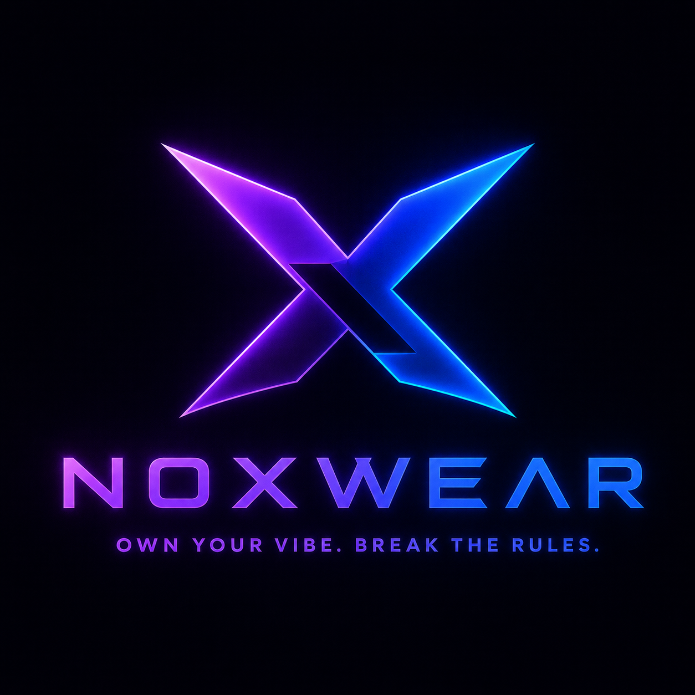
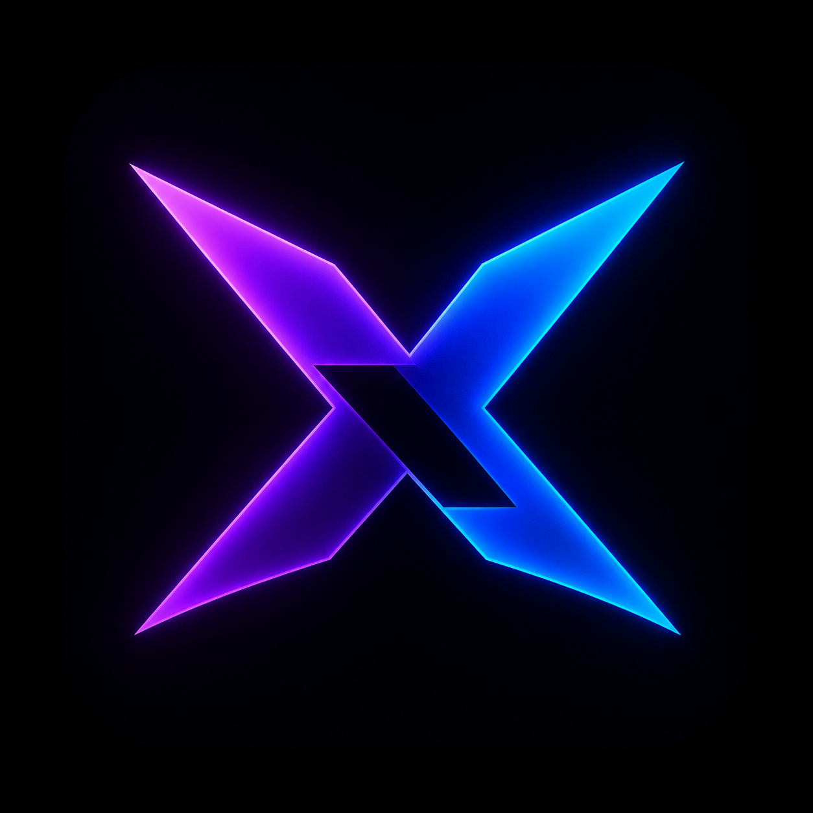

<p align="center">
  
</p>

<h1 align="center">NOXWEAR</h1>

<p align="center">
  <strong>OWN YOUR VIBE. BREAK THE RULES.</strong><br />
  <sub>streetwear for the ones who don't follow the feed.</sub>
</p>

<p align="center">
  
  
  
  
  
</p>

<p align="center">
  built by <a href="https://noxwear.com"><strong>Akira Omran</strong></a> · not your average clothing site
</p>

<br />

## the vibe

this isn't a boring shop page. it's a **full streetwear experience** — cinematic hero video, neon accents, smooth scroll animations, and a checkout flow that actually works.

scroll. tap. cart. pay. done.

<br />

## what's inside

| | what you get |
|---|---|
| 🎬 | **hero video** — first 3 seconds hit different |
| 🛍️ | **product grid** — tap a fit, peep the details, add to cart |
| 🎨 | **size + color picker** — pick your combo, no guesswork |
| 🛒 | **persistent cart** — leaves and comes back? your cart remembers |
| 💳 | **checkout** — Instapay or Vodafone Cash + payment screenshot upload |
| 📱 | **fully responsive** — looks clean on phone, tablet, desktop |
| 🔍 | **SEO locked in** — meta tags, JSON-LD, sitemap, robots.txt |

<br />

## pages

```
/                  →  the main character (landing)
/product?id=1      →  product deep-dive
/checkout          →  secure the bag
```

<br />

## the stack

no frameworks. no fluff. just raw power.

```
HTML5 · CSS3 · Vanilla JS
Lucide icons · SweetAlert2 · AOS animations
GoFile uploads · Google Apps Script orders
localStorage cart · SEO schema baked in
```

<br />

## folder layout

```
NOXWEAR/
├── assets/
│   ├── logo.png          ← favicon / brand mark
│   ├── banner.png        ← the banner you're staring at
│   └── Products/         ← product shots
├── checkout/             ← payment flow
├── const/product.js      ← all the fits (catalog data)
├── js/                   ← cart, SEO, UI magic
├── product/              ← single product page
├── style/                ← shared styles
├── index.html            ← entry point
├── sitemap.xml
└── robots.txt
```

<br />

## run it locally

```bash
# clone it
git clone <your-repo-url>
cd NOXWEAR

# fire it up (pick one)
npx serve .
# or just open index.html with Live Server
```

<br />

## take it live 🚀

static site. no backend server needed. just upload the folder and configure a few keys.

### 1 · pick where you host

| platform | vibe | how |
|---|---|---|
| **GitHub Pages** | free · clean · dev-friendly | push repo → Settings → Pages → deploy from `main` |
| **Netlify** | drag & drop energy | drag the `NOXWEAR` folder to [netlify.com/drop](https://app.netlify.com/drop) |
| **Vercel** | fast CDN | import repo at [vercel.com](https://vercel.com) → framework: **Other** |
| **Cloudflare Pages** | solid + free SSL | connect repo → build command: *(leave empty)* → output: `/` |

> all of these work because the site is pure HTML / CSS / JS. no build step required.

<br />

### 2 · configure before you ship

open these files and fill in your real values:

**`js/seo-config.js`** — your live domain + brand info
```js
siteUrl: "https://yourdomain.com",   // ← change this
email: "info@noxwear.com",
```

**`sitemap.xml`** + **`robots.txt`** — replace every `https://noxwear.com` with your real domain.

**`index.html`**, **`product/index.html`**, **`checkout/index.html`** — update `canonical` and `og:url` meta tags to match your domain.

<br />

**`checkout/main.js`** — payment + order flow
```js
const GOFILE_TOKEN = "your-gofile-api-token";
const SCRIPT_URL = "https://script.google.com/macros/s/YOUR_SCRIPT_ID/exec";

const PAYMENT_NUMBERS = {
  instapay: { label: "Instapay", number: "01XXXXXXXXX" },
  "vodafone-cash": { label: "Vodafone Cash", number: "01XXXXXXXXX" },
};
```

| key | where to get it |
|---|---|
| `GOFILE_TOKEN` | [gofile.io/myProfile](https://gofile.io/myProfile) → API token |
| `SCRIPT_URL` | Google Apps Script web app URL ending in `/exec` *(not `/dev`)* |
| `PAYMENT_NUMBERS` | your real Instapay / Vodafone Cash numbers |

<br />

### 3 · google sheets orders (optional but recommended)

1. create a Google Sheet with columns: `Date`, `Name`, `Phone`, `Email`, `Method`, `Total`, `Image URL`, `Products`
2. open **Extensions → Apps Script** and paste:

```js
function doPost(e) {
  const data = JSON.parse(e.parameter.data);
  const sheet = SpreadsheetApp.getActiveSpreadsheet().getActiveSheet();

  sheet.appendRow([
    new Date(),
    data.name,
    data.phone,
    data.email,
    data.method,
    data.total,
    data.imageUrl,
    JSON.stringify(data.products),
  ]);

  return ContentService
    .createTextOutput(JSON.stringify({ status: "ok" }))
    .setMimeType(ContentService.MimeType.JSON);
}
```

3. **Deploy → New deployment → Web app**
   - Execute as: **Me**
   - Who has access: **Anyone**
4. copy the `/exec` URL into `SCRIPT_URL` in `checkout/main.js`

<br />

### 4 · gofile payment uploads

1. create a GoFile account → get your API token
2. paste token into `GOFILE_TOKEN` in `checkout/main.js`
3. payment screenshots upload automatically on checkout with renamed files:
   ```
   instapay-01XXXXXXXXX-DD-MM-YYYY_HH-MM-SS.jpg
   ```

<br />

### 5 · connect your domain

after deploying on any platform:

1. buy / use your domain (e.g. `noxwear.com`)
2. in your host's DNS settings, point the domain to the deployment
3. enable **HTTPS / SSL** (most hosts do this free automatically)
4. update `siteUrl` in `js/seo-config.js` to `https://yourdomain.com`
5. re-upload or push so sitemap + meta tags match

<br />

### 6 · launch checklist

```
□  GOFILE_TOKEN set in checkout/main.js
□  SCRIPT_URL set (ends with /exec)
□  PAYMENT_NUMBERS updated with real numbers
□  siteUrl updated in js/seo-config.js
□  sitemap.xml + robots.txt domain updated
□  canonical + og:url tags updated in all HTML pages
□  test add to cart → checkout → upload screenshot → order saved
□  site loads on mobile
□  tell the group chat it's live
```

<br />

## brand card

<p align="center">
  
</p>

<p align="center">
  <strong>NOXWEAR</strong><br />
  Own Your Vibe. BREAK THE RULES.<br /><br />
  <a href="mailto:info@noxwear.com">info@noxwear.com</a>
</p>

<br />

<p align="center">
  <sub>© 2026 NOXWEAR · all rights reserved · crafted by Akira Omran</sub>
</p>
